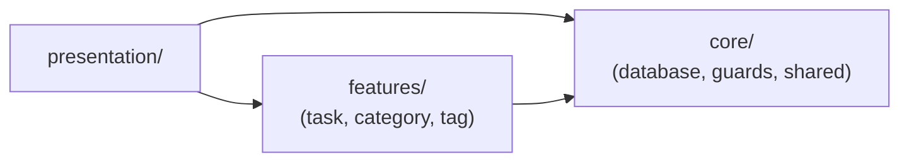
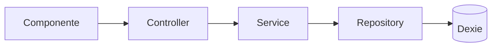

# Arquitectura general

Describe el patrón de capas del proyecto y cómo se organiza el código alrededor de él. Para el
detalle de la capa de datos (Dexie/IndexedDB), ver [dexie-arquitectura.md](dexie-arquitectura.md).

## El patrón: hexagonal lite por feature

Cada dominio de negocio (`task`, `category`, `tag`) es una **feature** independiente en
`src/app/features/<nombre>/`, dividida siempre en las mismas tres capas:

| Capa | Carpeta | Responsabilidad |
|---|---|---|
| Dominio | `domine/` | Entidad (forma de los datos) y el contrato del repository (`ITaskRepository`, interfaz) |
| Aplicación | `application/` | Controller (validación + errores), service (estado reactivo), DTOs |
| Infraestructura | `infraestruture/` | Implementación concreta del repository (Dexie) |

La regla de dependencia va en una sola dirección:

```
presentation/  →  application/ (controller → service)  →  domine/  ←  infraestruture/
```

`domine/` no importa nada de las otras dos capas — define el contrato, y `infraestruture/` lo
implementa. `presentation/` solo conoce `application/`; nunca importa Dexie ni un repository
directamente.

## Vista general de capas

Una sola flecha, un solo significado: **"puede importar de"**.



- **`presentation/`** puede importar de `features/` (controllers/services) y de `core/`
  (guards, utilidades).
- **`features/`** puede importar de `core/` (por ejemplo, `database/` para el token `APP_DB`).
- **`core/`** no depende de ninguna feature — **con una excepción**: `guards/` sí importa
  controllers/services de una feature concreta, porque su trabajo es justamente preguntarle a esa
  feature si puede dejar pasar la navegación (ej. `task.guard.ts` le pregunta a `TaskService` si la
  tarea de la URL existe). Es la única flecha que va en sentido contrario a la regla general.
- **`features/`** contiene la lógica de negocio, sin saber nada de Angular Router ni de cómo se
  ve la UI.
- **`presentation/`** es la única capa que sabe de componentes, rutas y estilos.

## El patrón por feature, en detalle



No todas las features necesitan las tres piezas de `application/` completas:

| Feature | Controller | Service | Repository | Por qué |
|---|---|---|---|---|
| `task` | Sí | Sí (con `computed()` de hidratación) | `getAll`, `getById`, `add`, `update`, `delete` | Tiene entrada de usuario (formularios) que validar y varias operaciones de escritura |
| `category` | No | Sí (expone signals) | Solo `getAll` | Catálogo de solo lectura, sin creación/edición desde la UI |
| `tag` | No | Sí (expone signals) | Solo `getAll` | Igual que `category` |

`category` y `tag` omiten el controller porque no hay ninguna entrada externa que validar ni
errores de escritura que centralizar — el service ya es la interfaz pública suficiente para esos
casos.

## `presentation/`: atomic design

Los componentes de UI se organizan por nivel de composición:

```
components/ui/
  01-atoms/       piezas mínimas (button, input, icon, badge, tag)
  02-molecules/   combinan átomos (card, form-task, dialog, tabs, navaside)
  04-layout/      estructura de página (general-layout)
pages/
  dashboard/      rutas y páginas del flujo principal
  home/           página de prueba (fuera de rutas)
```

Los componentes de `02-molecules/` y las páginas son los que inyectan un controller o service de
`features/`; los átomos de `01-atoms/` son puramente presentacionales y no conocen ninguna feature.

## Ver también

- [dexie-arquitectura.md](dexie-arquitectura.md) — esquema de datos, versionado de Dexie, y el
  límite `categoriaId`/`tagIds` dentro del repository de `task`.
