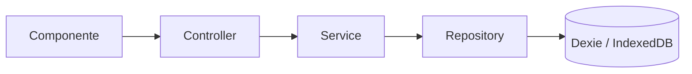

# Arquitectura de persistencia

Describe cómo está organizada la capa de datos de la app y por qué tiene esa forma.

## Propósito

El dominio de esta app (tareas con categoría y etiquetas) es simple — no necesita capas separadas
para funcionar. La estructura hexagonal (lite) existe como ejercicio de aprendizaje: practicar
separación de responsabilidades en Angular, no porque el problema lo exija. Ver
[README](../README.md#idea-de-negocio).

## Capas y flujo de datos



- **Componente** — UI; siempre inyecta el controller, nunca el service, el repository ni Dexie
  directamente.
- **Controller** (`task.controller.ts`) — valida el DTO de entrada con Zod y centraliza el manejo de
  errores (`ControllerException`), devolviendo siempre `{ ok: true, data }` o
  `{ ok: false, message }` para que el componente no necesite `try/catch`.
- **Service** (`task.service.ts`) — estado reactivo con Signals; hidrata ids a objetos resueltos.
- **Repository** (`task.repository.dexie.ts`) — única capa que conoce Dexie y el esquema de la fila.
- **Dexie** — `AppTaskDataBase`, con tablas `tasks`, `categories`, `tags`.

Cada feature (`task`, `category`, `tag`) repite esta misma estructura en
`src/app/features/<nombre>/`: `domain/` (entidad + contrato del repository), `application/`
(controller, service, DTOs), `infrastructure/` (implementación Dexie). `category` y `tag` no tienen
controller propio porque solo exponen `getAll()` — sin validación de entrada que centralizar.

## Principios de diseño

### SSR-safe vía token de inyección

`APP_DB` ([db.provider.ts](../src/app/core/database/db.provider.ts)) es `null` en el servidor
(`isPlatformBrowser` lo determina), porque `indexedDB` no existe en Node. Los repositories tratan
esa instancia como opcional (`this.db?.tasks...`) y devuelven un valor neutro (`[]`, `undefined`,
`0`) cuando no hay DB. Así la página renderiza en SSR sin lanzar `ReferenceError`, y se llena tras
hidratar en el navegador.

### Versionado incremental de Dexie

Cada cambio en la forma de los datos se declara como una versión nueva de Dexie
(`this.version(n).stores(...)`), nunca modificando una ya aplicada. Cuando una tarea nueva de datos
requiere migrar filas existentes, la versión incluye un `.upgrade()`. Esto permite que una fila
creada en la versión más antigua siga siendo válida en la actual sin perder información. Ver
[app.db.ts](../src/app/core/database/app.db.ts).

### `categoriaId`/`tagIds` como vocabulario exclusivo del repository

`TaskRow` (la fila tal como se persiste) referencia categoría y etiquetas por id, con nombre
explícito: `categoriaId: number`, `tagIds: number[]`. El resto de las capas —`TaskEntity`, los DTOs,
el formulario— habla de `categoria`/`tags`; a ese nivel también son solo ids, el objeto resuelto
existe únicamente en `TaskViewModel`, después de pasar por el service.

La traducción entre ambos nombres vive en un solo punto,
[task.repository.dexie.ts](../src/app/features/task/infrastructure/task.repository.dexie.ts):

```ts
function rowToEntity(row: TaskRow): TaskEntity {
  const { categoriaId, tagIds, ...rest } = row;
  return { ...rest, categoria: categoriaId, tags: tagIds };
}
```

El sufijo `Id` solo le importa a quien lee o escribe filas de IndexedDB. Mantenerlo fuera de las
demás capas evita que un detalle de cómo se guarda el dato obligue a tocar entidad, DTOs y
formularios cada vez que cambia.

### Hidratación de ids a objetos, en el service

`TaskService.$tasks` ([task.service.ts](../src/app/features/task/application/task.service.ts)) es
el único punto donde `categoria`/`tags` (ids) se cruzan con los signals de `CategoryService`/
`TagService` para producir `TaskViewModel` con los objetos ya resueltos. Esa responsabilidad vive en
el service, no en el repository, porque ahí ya están disponibles esos signals cargados en memoria;
resolverlo desde el repository implicaría que la capa de infraestructura dependa de otras features.

## Alcance deliberado

- **Sin `BaseRepository` genérico.** Con 3 repositories —dos de ellos con un único método
  (`getAll`)— esa abstracción no tiene reutilización real. Cada repository escribe su propio guard
  de null (`db?.` + valor neutro).
- **El índice de `tasks` no incluye `title`/`description`.** Son campos de texto libre que nunca se
  consultan con `where()`.
- **`tagIds` es un índice multi-entry (`*tagIds`)**, lo que permite filtrar tareas por un tag
  individual con `where('tagIds').equals(id)`.

## Cómo verificar

1. `pnpm start` → crear/editar/borrar una tarea, recargar el navegador, comprobar que persiste. En
   DevTools → Application → IndexedDB debe verse la base `AppTaskDataBase`.
2. SSR: `pnpm build && pnpm serve:ssr:to-do`, abrir `/dashboard`. No debe aparecer
   `ReferenceError: indexedDB is not defined`.
3. `npx tsc -p tsconfig.app.json --noEmit` — sin errores de tipos.
